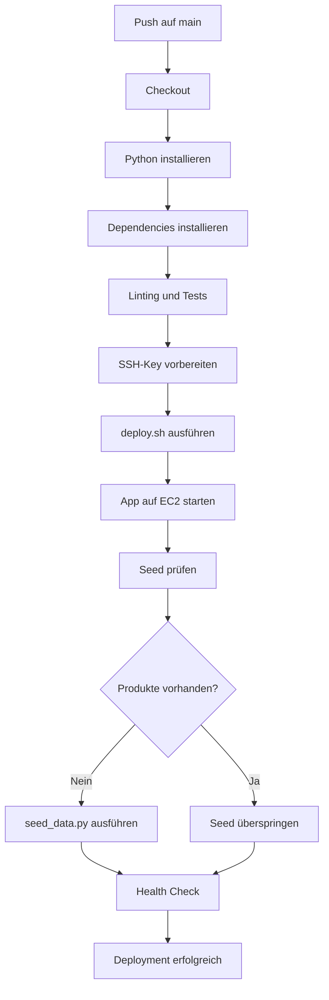
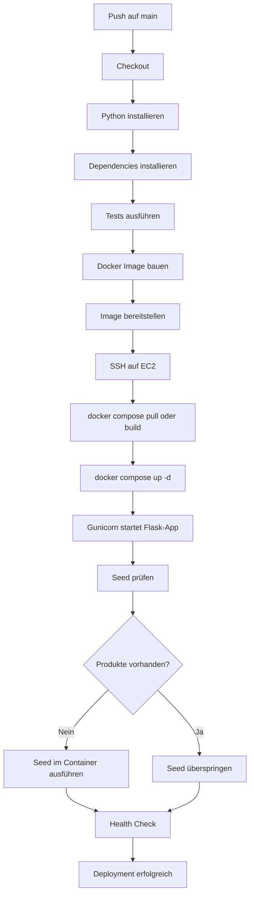
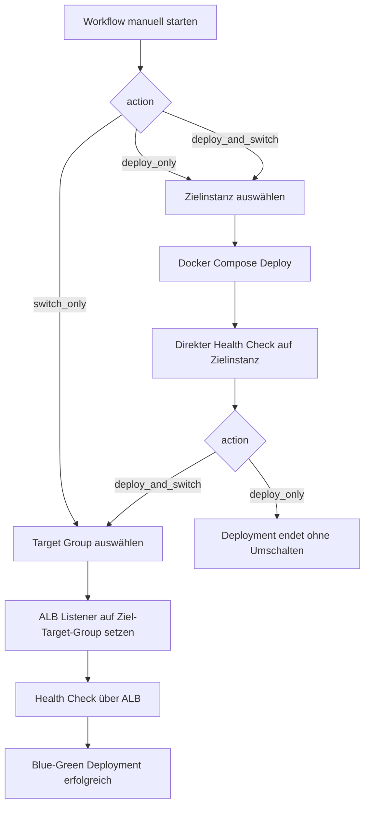
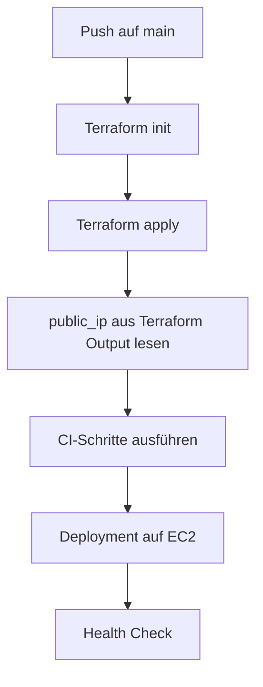

# TechStyle Praxisaufträge: CI/CD Deployment auf AWS EC2

In diesen Praxisaufträgen erweitert ihr die bestehende Python/Flask-App um ein Deployment auf AWS EC2. Die bestehende Pipeline `.github/workflows/ci.yml` ist die Grundlage. Darauf aufbauend erstellt ihr eine neue Pipeline:

```text
.github/workflows/ci_cd.yml
```

Terraform wird in beiden Praxisaufträgen zuerst lokal ausgeführt. Die dadurch erzeugte öffentliche EC2-IP wird anschliessend in GitHub als Variable hinterlegt und von der Deployment-Pipeline verwendet.

## Ausgangslage

Dieses Repository enthält eine einfache Flask-Webapp:

- `app.py` - Flask-Applikation
- `seed_data.py` - Demo-Produkte für die SQLite-Datenbank
- `requirements.txt` - Python-Abhängigkeiten
- `deploy.sh` - einfaches SSH/SCP-Deployment
- `infra/` - fertige Terraform/OpenTofu-Infrastruktur mit Cloud-Init
- `.github/workflows/ci.yml` - bestehende CI-Pipeline

Die bestehende `ci.yml` soll nicht ersetzt werden. Sie dient als Referenz für Linting, Tests und Build. Für die Praxisaufträge erstellt ihr zusätzlich `ci_cd.yml`.

Für die Musterlösung gibt es zusätzlich eine Docker-Variante:

```text
.github/workflows/ci_cd_docker.yml
```

Diese Pipeline zeigt die vollständige Lösung für Praxisauftrag 2 mit Docker Compose und Gunicorn.

## Gemeinsame Voraussetzung für beide Praxisaufträge

Bevor ihr die App deployt, erstellt ihr lokal eine EC2-Instanz mit der mitgelieferten Infrastruktur im Ordner `infra/`.

Ihr müsst Terraform und Cloud-Init nicht selbst schreiben. Ihr führt die vorbereitete Infrastruktur nur aus und verwendet danach die ausgegebene IP-Adresse für eure Pipeline.

Es gibt zwei getrennte Infrastruktur-Vorlagen:

```text
infra/praxisauftrag-1
infra/praxisauftrag-2
infra/praxisauftrag-3
```

`praxisauftrag-1` installiert bewusst kein Docker. `praxisauftrag-2` installiert Docker und Docker Compose.
`praxisauftrag-3` erstellt eine Blue-Green-Infrastruktur mit zwei EC2-Instanzen und einem Application Load Balancer.

Ihr könnt entweder Terraform oder OpenTofu verwenden:

```bash
terraform version
```

oder:

```bash
tofu version
```

### 1. AWS vorbereiten

Konfiguriert zuerst eure AWS Learner-Lab-Credentials lokal:

```bash
aws configure
```

Gebt dabei die Werte aus dem Learner Lab ein:

```text
AWS Access Key ID: <Access Key>
AWS Secret Access Key: <Secret Key>
Default region name [us-east-1]:
Default output format [json]:
```

Stellt danach sicher, dass eure Credentials aktiv sind:

```bash
aws sts get-caller-identity
```

Wenn der Befehl keine gültige Identität ausgibt, müsst ihr eure AWS Credentials zuerst neu setzen.

### 2. SSH-Key vorbereiten

Die EC2-Instanz braucht euren Public Key, damit ihr und später die Pipeline per SSH verbinden könnt.

Falls ihr noch keinen SSH-Key habt:

```bash
ssh-keygen -t ed25519 -C "techstyle"
```

Standardmässig erwartet die Terraform-Vorlage diesen Public Key:

```text
~/.ssh/id_ed25519.pub
```

Wenn ihr einen anderen Key verwendet, gebt den Pfad beim Ausführen an.

Prüft danach, ob der Public Key existiert:

```bash
ls ~/.ssh/id_ed25519.pub
```

Unter Windows PowerShell:

```powershell
Test-Path ~/.ssh/id_ed25519.pub
```

Wenn die Datei fehlt, wurde der Key noch nicht erstellt oder an einem anderen Ort gespeichert.

### 3. Richtigen Infrastruktur-Ordner wählen

Für Praxisauftrag 1:

```bash
cd infra/praxisauftrag-1
```

Für Praxisauftrag 2:

```bash
cd infra/praxisauftrag-2
```

Für Praxisauftrag 3:

```bash
cd infra/praxisauftrag-3
```

Terraform sucht automatisch die aktuellste Ubuntu 22.04 LTS AMI für die konfigurierte Region.

Optional könnt ihr die Beispiel-Variablen kopieren:

```bash
cp terraform.tfvars.example terraform.tfvars
```

Unter Windows PowerShell:

```powershell
Copy-Item terraform.tfvars.example terraform.tfvars
```

Tragt dort euren Public Key ein, damit die Pipeline später per SSH deployen kann:

```hcl
ssh_public_key_path = "~/.ssh/id_ed25519.pub"
```

Die mitgelieferte Infrastruktur erstellt:

- eine EC2-Instanz
- eine eigene VPC mit Public Subnet, Internet Gateway und Route Table
- eine Security Group
- eine öffentliche IPv4-Adresse für die EC2-Instanz
- SSH-Zugriff über den Public Key aus `ssh_public_key_path`
- Cloud-Init Setup beim ersten Start

Es wird keine Elastic IP erstellt. Wenn ihr die EC2-Instanz neu erstellt, bekommt sie eine neue öffentliche IP-Adresse.

Die EC2-Instanz soll mindestens Folgendes bereitstellen:

- Ubuntu Server
- SSH-Zugriff mit eurem Key
- Security Group für SSH
- Security Group für die App
- Cloud-Init zur Installation der benötigten Software

Cloud-Init für Praxisauftrag 1 installiert:

- Python 3
- pip
- venv
- Git
- SQLite
- curl

Cloud-Init für Praxisauftrag 2 installiert zusätzlich:

- Docker
- Docker Compose Plugin

### 4. Terraform oder OpenTofu lokal ausführen

Mit Terraform:

```bash
terraform init
terraform plan
terraform apply
```

Mit OpenTofu:

```bash
tofu init
tofu plan
tofu apply
```

Wenn euer Public Key nicht unter `~/.ssh/id_ed25519.pub` liegt, gebt den Pfad explizit an:

```bash
terraform apply -var="ssh_public_key_path=~/.ssh/id_rsa.pub"
```

IP auslesen:

```bash
terraform output -raw public_ip
```

Mit OpenTofu:

```bash
tofu output -raw public_ip
```

App-URL anzeigen:

```bash
terraform output app_url
```

SSH-Befehl anzeigen:

```bash
terraform output ssh_command
```

### 5. GitHub Repository konfigurieren

Tragt die EC2-Verbindungsdaten in GitHub ein.

Unter `Settings -> Secrets and variables -> Actions -> Variables`:

```text
PA1_EC2_HOST=<public-ip-aus-terraform-fuer-praxisauftrag-1>
PA2_EC2_HOST=<public-ip-aus-terraform-fuer-praxisauftrag-2>
EC2_USER=ubuntu
```

Unter `Settings -> Secrets and variables -> Actions -> Secrets`:

```text
EC2_SSH_KEY=<privater SSH-Key>
```

Der private SSH-Key muss zu dem Public Key passen, der beim Erstellen der EC2-Instanz hinterlegt wurde.

## Praxisauftrag 1: Deployment mit deploy.sh

### Ziel

Ihr erstellt eine erste CI/CD-Pipeline, die die Flask-App nach erfolgreichem Testlauf auf eine EC2-Instanz deployt. Das Deployment erfolgt mit dem bestehenden `deploy.sh`.

Diese Variante ist bewusst einfach. Sie zeigt, wie ein Deployment mit SSH und SCP grundsätzlich funktioniert.

### Aufgabe

Erstellt die Datei:

```text
.github/workflows/ci_cd.yml
```

Die Pipeline soll:

1. Bei Push auf `main` starten.
2. Den Code auschecken.
3. Python installieren.
4. Dependencies aus `requirements.txt` installieren.
5. Linting oder Tests ausführen.
6. Den SSH-Key aus `EC2_SSH_KEY` vorbereiten.
7. Die App mit `deploy.sh` auf die EC2-Instanz deployen.
8. Die Datenbank nur dann seeden, wenn noch keine Produktdaten vorhanden sind.
9. Einen Health Check gegen die laufende App ausführen.

### Erwarteter Ablauf



### Hinweise zu deploy.sh

Das bestehende `deploy.sh` kopiert die App per `scp` auf den Server und startet sie per SSH neu.

Ihr müsst sicherstellen, dass das Script die Werte aus GitHub Actions verwenden kann, zum Beispiel:

```bash
PA1_EC2_HOST
EC2_USER
EC2_SSH_KEY
```

Das Script darf nicht fest an eine alte IP-Adresse gebunden sein, weil die EC2-IP nach dem Neuerstellen der Instanz wechseln kann.

### Seed-Daten

`seed_data.py` enthält die Demo-Produkte. Das Script darf nicht bei jedem Deployment blind ausgeführt werden, weil es bestehende Produkte löscht und neu anlegt.

Prüft deshalb zuerst, ob Produkte vorhanden sind:

```sql
SELECT COUNT(*) FROM products;
```

Nur wenn keine Produkte vorhanden sind, soll `seed_data.py` ausgeführt werden.

### Health Check

Die Pipeline soll am Schluss prüfen, ob die App erreichbar ist:

```bash
curl -f http://$PA1_EC2_HOST:5001/api/products
```

Wenn der Health Check fehlschlägt, soll die Pipeline fehlschlagen.

### Abgabe

Am Ende von Praxisauftrag 1 sollen vorhanden sein:

- `.github/workflows/ci_cd.yml`
- lauffähiges Deployment auf EC2
- App erreichbar über `http://<PA1_EC2_HOST>:5001`
- Produkte werden unter `/api/products` zurückgegeben
- kurze Dokumentation der aktuellen Deployment-URL

## Praxisauftrag 2: Produktives Deployment mit Docker Compose

### Ziel

Ihr ersetzt das einfache SSH/SCP-Deployment durch ein produktionsnäheres Deployment mit Docker Compose. Die Flask-App soll nicht mehr direkt mit `python app.py` laufen, sondern mit Gunicorn.

### Aufgabe

Erweitert oder ersetzt eure `ci_cd.yml` so, dass die App containerisiert deployt wird.

Die Lösung soll enthalten:

1. Einen `Dockerfile`.
2. Eine `docker-compose.yml`.
3. Start der Flask-App mit Gunicorn.
4. Deployment auf EC2 über GitHub Actions.
5. Einen Health Check nach dem Deployment.
6. Idempotentes Seeding der Datenbank.

### Erwarteter Ablauf



### Gunicorn

In der produktiven Variante soll die App mit Gunicorn gestartet werden, zum Beispiel:

```bash
gunicorn -w 2 -b 0.0.0.0:5001 app:app
```

Nicht verwenden für die produktive Variante:

```bash
python app.py
```

### Docker Compose

Die EC2-Instanz soll durch Cloud-Init Docker und Docker Compose installiert bekommen. Die Pipeline verbindet sich danach per SSH mit der Instanz und startet die App mit:

```bash
docker compose up -d
```

Je nach Lösung kann das Docker Image direkt auf der EC2-Instanz gebaut oder vorher in einer Registry wie GHCR veröffentlicht werden.

Für diesen Praxisauftrag reicht die einfachere Variante:

```text
GitHub Actions -> SSH auf EC2 -> Repository/Dateien aktualisieren -> docker compose up -d --build
```

### Persistente Daten

SQLite darf für diesen Auftrag weiterverwendet werden. Die Datenbank darf aber nicht in einem flüchtigen Container-Dateisystem verschwinden.

Verwendet deshalb ein Volume oder einen Host-Pfad, zum Beispiel:

```text
/opt/techstyle/data/techstyle.db
```

Die App und `seed_data.py` müssen denselben Datenbankpfad verwenden.

### Health Check

Auch in Praxisauftrag 2 muss die Pipeline am Ende prüfen, ob die App läuft:

```bash
curl -f http://$PA2_EC2_HOST:5001/api/products
```

Optional kann später ein Reverse Proxy wie Caddy oder Nginx ergänzt werden. Für diesen Auftrag ist Port `5001` ausreichend.

### Abgabe

Am Ende von Praxisauftrag 2 sollen vorhanden sein:

- `.github/workflows/ci_cd.yml`
- `Dockerfile`
- `docker-compose.yml`
- optional als Musterlösung: `.github/workflows/ci_cd_docker.yml`
- App startet mit Gunicorn
- App läuft auf EC2 in Docker Compose
- Datenbank ist persistent
- Produkte werden nicht bei jedem Deploy gelöscht
- Health Check läuft in der Pipeline

## Praxisauftrag 3: Blue-Green Deployment mit ALB

### Ziel

Ihr erweitert das Docker-Deployment zu einem Blue-Green Deployment. Dafür gibt es zwei EC2-Instanzen:

```text
blue  = aktuelle oder vorherige Version
green = neue oder nächste Version
```

Ein Application Load Balancer (ALB) entscheidet, welche Umgebung den Live-Traffic erhält.

### Infrastruktur

Für diesen Auftrag verwendet ihr:

```bash
cd infra/praxisauftrag-3
terraform init
terraform apply
```

Die Terraform-Vorlage erstellt:

- eine VPC
- zwei Public Subnets in unterschiedlichen Availability Zones
- zwei EC2-Instanzen: Blue und Green
- Docker und Docker Compose auf beiden Instanzen
- einen Application Load Balancer
- zwei Target Groups: Blue und Green
- einen HTTP Listener, der initial auf Blue zeigt

Outputs anzeigen:

```bash
terraform output
```

Wichtige Outputs:

```text
blue_public_ip
green_public_ip
alb_dns_name
alb_listener_arn
blue_target_group_arn
green_target_group_arn
```

### GitHub Variables und Secrets

Tragt die Terraform Outputs in GitHub ein.

Unter `Settings -> Secrets and variables -> Actions -> Variables`:

```text
PA3_BLUE_EC2_HOST=<blue_public_ip>
PA3_GREEN_EC2_HOST=<green_public_ip>
EC2_USER=ubuntu
PA3_ALB_DNS_NAME=<alb_dns_name>
PA3_ALB_LISTENER_ARN=<alb_listener_arn>
PA3_BLUE_TARGET_GROUP_ARN=<blue_target_group_arn>
PA3_GREEN_TARGET_GROUP_ARN=<green_target_group_arn>
PA3_AWS_REGION=us-east-1
```

Unter `Settings -> Secrets and variables -> Actions -> Secrets`:

```text
EC2_SSH_KEY=<privater SSH-Key>
```

Wenn die Pipeline den ALB automatisch umschalten soll, braucht sie zusätzlich AWS Credentials:

```text
AWS_ACCESS_KEY_ID
AWS_SECRET_ACCESS_KEY
AWS_SESSION_TOKEN
```

Diese Werte kommen aus dem AWS Learner Lab. Der Session Token läuft ab und muss nach einem Neustart des Learner Labs in GitHub aktualisiert werden.

### Pipeline

Die Musterlösung liegt in:

```text
.github/workflows/ci_cd_blue_green.yml
```

Beim manuellen Start wählt ihr:

```text
action = deploy_only, deploy_and_switch oder switch_only
deploy_target = blue oder green
```

Empfohlener Ablauf:

```text
1. Aktuell zeigt der ALB auf Blue.
2. Pipeline manuell starten mit action=deploy_only und deploy_target=green.
3. Pipeline deployed die neue Version auf Green.
4. Pipeline prüft Green direkt über Port 5001.
5. Wenn alles funktioniert: action=switch_only und deploy_target=green.
6. Pipeline schaltet den ALB Listener auf Green, ohne Green nochmals zu deployen.
7. Bei Problemen: action=switch_only und deploy_target=blue.
```

Grundregel:

```text
Deploye immer auf die inaktive Farbe.

Wenn Blue live ist: neue Version auf Green deployen.
Wenn Green live ist: neue Version auf Blue deployen.
```

### Testablauf: Manuelles Umschalten

Nachdem die Infrastruktur mit Terraform erstellt wurde, testet zuerst, ob die App über den Load Balancer erreichbar ist:

```text
http://<PA3_ALB_DNS_NAME>
http://<PA3_ALB_DNS_NAME>/api/products
```

Nehmt danach eine sichtbare Änderung in der App vor, damit ihr Blue und Green klar unterscheiden könnt.

Empfohlene Teständerung: Ändert die Farbe der Navbar in `static/css/style.css` auf grün.

Ergänzt zuerst bei den Brand-Farben eine grüne Variable:

```css
:root {
  --ts-red:    #dc3545;
  --ts-dark:   #1a1a2e;
  --ts-mid:    #16213e;
  --ts-accent: #e94560;
  --ts-green:  #198754;
}
```

Ändert danach die Navbar.

Vorher:

```css
.navbar {
  background-color: var(--ts-dark) !important;
  box-shadow: 0 2px 8px rgba(0,0,0,.35);
}
```

Nachher:

```css
.navbar {
  background-color: var(--ts-green) !important;
  box-shadow: 0 2px 8px rgba(0,0,0,.35);
}
```

Damit ist die Green-Version grün erkennbar, während die alte Blue-Version weiterhin dunkelblau ist.

Wenn der ALB aktuell auf Blue zeigt, startet die Pipeline manuell mit:

```text
action = deploy_only
deploy_target = green
```

Damit wird die neue Version auf Green deployed, aber der ALB bleibt noch auf Blue. Prüft Green direkt:

```text
http://<PA3_GREEN_EC2_HOST>:5001
http://<PA3_GREEN_EC2_HOST>:5001/api/products
```

Wenn Green funktioniert, schaltet den ALB manuell in der AWS Console um:

```text
EC2 -> Load Balancers -> euren ALB auswählen
Listeners -> HTTP:80 auswählen
Default action bearbeiten
Forward to: green Target Group
Speichern
```

Prüft danach wieder über den Load Balancer:

```text
http://<PA3_ALB_DNS_NAME>
http://<PA3_ALB_DNS_NAME>/api/products
```

Jetzt sollte die neue Version sichtbar sein.

Rollback manuell testen:

```text
EC2 -> Load Balancers -> euren ALB auswählen
Listeners -> HTTP:80 auswählen
Default action bearbeiten
Forward to: blue Target Group
Speichern
```

Prüft danach erneut:

```text
http://<PA3_ALB_DNS_NAME>
```

Jetzt sollte wieder die Blue-Version aktiv sein.

### Testablauf: Automatisches Umschalten

Für automatisches Umschalten braucht die Pipeline AWS-Zugriff. Konfiguriert dafür in GitHub zusätzlich diese Secrets:

```text
AWS_ACCESS_KEY_ID
AWS_SECRET_ACCESS_KEY
AWS_SESSION_TOKEN
```

und diese Variable:

```text
PA3_AWS_REGION=us-east-1
```

Diese Credentials müssen zu eurem aktuellen AWS Learner Lab passen.

Startet danach die Pipeline mit:

```text
action = deploy_and_switch
deploy_target = green
```

Die Pipeline macht dann automatisch:

```text
1. Deploy auf Green
2. Direkter Health Check auf Green
3. ALB Listener auf Green Target Group umschalten
4. Health Check über den ALB
```

Automatischen Rollback testen:

```text
action = switch_only
deploy_target = blue
```

Danach sollte der ALB wieder auf Blue zeigen. Wichtig: Bei `switch_only` wird Blue nicht neu deployed. Die ältere Version auf Blue bleibt erhalten.

### Erwarteter Ablauf



### Rollback

Rollback bedeutet: ALB zurück auf die andere Farbe schalten, ohne diese Instanz neu zu deployen.

Beispiel:

```text
Aktuell live: green
Rollback-Ziel: blue
action=switch_only
deploy_target=blue
```

Wenn auf Blue bereits eine funktionierende ältere Version läuft, wird der ALB wieder auf Blue geschaltet.

## Endlösung: Terraform in die Pipeline integrieren

Zum Schluss wird gezeigt, wie die manuelle Übergabe der IP-Adresse automatisiert werden kann.

Die Endlösung liest die EC2-IP direkt aus Terraform aus:

```bash
EC2_HOST=$(terraform output -raw public_ip)
```

Dann muss die IP nicht mehr manuell in GitHub aktualisiert werden.



Diese Variante ist die professionellere Endlösung. Für die beiden Praxisaufträge wird Terraform aber zuerst bewusst lokal ausgeführt, damit Infrastruktur und Deployment getrennt verstanden werden.

## Bewertungsideen für Classroom

Mögliche Prüfpunkte für Praxisauftrag 1:

- `.github/workflows/ci_cd.yml` existiert
- Pipeline enthält Tests
- Pipeline verwendet SSH
- Pipeline verwendet `deploy.sh`
- Pipeline verwendet GitHub Secrets oder Variables
- Seed-Daten werden nicht bei jedem Deployment destruktiv neu geladen
- Health Check ist vorhanden

Mögliche Prüfpunkte für Praxisauftrag 2:

- `Dockerfile` existiert
- `docker-compose.yml` existiert
- Pipeline baut oder startet Docker Compose
- Gunicorn wird verwendet
- produktiver Start verwendet nicht `python app.py`
- persistenter Datenbankpfad oder Volume vorhanden
- Health Check ist vorhanden

Mögliche Prüfpunkte für Praxisauftrag 3:

- `infra/praxisauftrag-3` existiert
- Terraform erstellt zwei EC2-Instanzen
- Terraform erstellt einen Application Load Balancer
- Terraform erstellt zwei Target Groups
- Pipeline enthält `deploy_target` mit `blue` und `green`
- Pipeline kann gezielt auf Blue oder Green deployen
- Pipeline enthält einen direkten Health Check
- Pipeline kann optional den ALB Listener umschalten

## Aufräumen

Vergesst nach dem Auftrag nicht, die AWS-Ressourcen wieder zu löschen:

```bash
# In den gleichen Ordner wechseln, in dem ihr apply ausgeführt habt:
cd infra/praxisauftrag-1
terraform destroy
```

Für Praxisauftrag 2 entsprechend:

```bash
cd infra/praxisauftrag-2
terraform destroy
```

Für Praxisauftrag 3 entsprechend:

```bash
cd infra/praxisauftrag-3
terraform destroy
```

Prüft danach in der AWS Console, ob keine EC2-Instanz, kein EBS-Volume und keine unnötigen Security Groups weiterlaufen.
